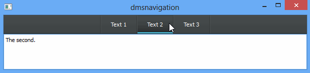

DMS Navigation
=========

The DMS Navigation widget implements a beautiful tab widget alternative for Qt.
The widget is implemented as Qt Widget and **not** QML.

I use this widget in a private project and decided to publish it beacuase it looks beautiful.



API
----
The API implements a set of methods you know from QTabWidget.

```cpp
int addTab(QWidget* widget, const QString& text);
int addTab(QWidget* widget, const QIcon& icon, const QString& text);

int insertTab(int index, QWidget* widget, const QString& text);
int insertTab(int index, QWidget* widget, const QIcon& icon, const QString& text);

void removeTab(int index);

QString tabText(int index) const;
void setTabText(int index, const QString& text);

QIcon tabIcon(int index) const;
void setTabIcon(int index, const QIcon& icon);

enum HorizontalAlignment { AlignLeft, AlignCenter, AlignRight };

HorizontalAlignment horizontalAlignment() const;
void setHorizontalAlignment(HorizontalAlignment alignment);

int count() const;
int currentIndex() const;

public slots:
void setCurrentIndex(int index);
```

Usage
----
Using the widget is pretty simple. This is the example of the GIF you see above.

```cpp
int main(int argc, char** argv)
{
   QApplication app(argc, argv);

   DMSNavigation navi;
   navi.resize(600, 50);
   navi.show();

   navi.addTab(new QTextEdit("The first."), "Text 1");
   navi.addTab(new QTextEdit("The second."), "Text 2");
   navi.addTab(new QTextEdit("The third."), "Text 3");

   return app.exec();
}
```

Version
----

#### 1.0
Initial realease.


Thank you thibaut.
-----------
A special thank goes to **thibaut** who designed and inspired me. The widget was implemented as HTML and CSS control and I found it on the following site: http://ui-cloud.com/dark-navigation/.

License
----
MIT

**Free Software, Hell Yeah!**